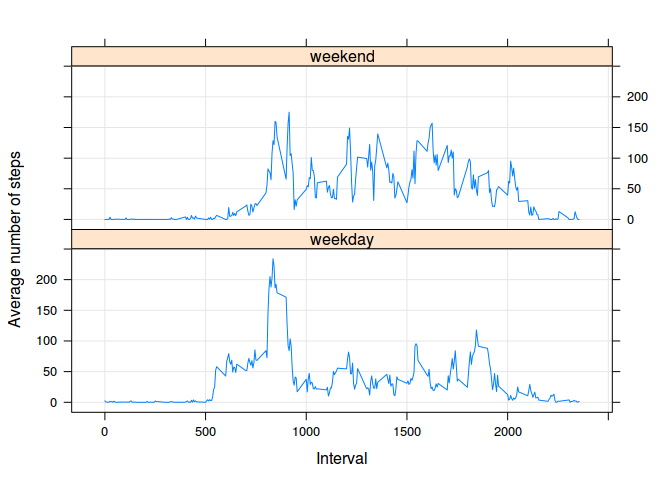

# Reproducible Research: Peer Assessment 1


## Loading and preprocessing the data

```r
origdf<-read.csv("./activity.csv")
df<-origdf #origdf as backup
#df[is.na(df$steps),"steps"]=0
```

## What is mean total number of steps taken per day?

```r
library(sqldf) #load sqldf for easy averaging
```

```
## Loading required package: DBI
## Loading required package: gsubfn
## Loading required package: proto
## Loading required package: chron
## Loading required package: RSQLite
## Loading required package: RSQLite.extfuns
```

```r
countframe <- sqldf("SELECT SUM(steps) FROM df GROUP BY date")
```

```
## Loading required package: tcltk
```

```r
countframe[is.na(countframe[,"SUM(steps)"]),"SUM(steps)"]=0 #assume all NAs=0
countframe[,"SUM(steps)"]=as.numeric(countframe[,"SUM(steps)"])

hist(countframe[,"SUM(steps)"], main="Histogram of total number of steps per day", xlab="Total number of steps",)
```

 

```r
mean(countframe[,"SUM(steps)"])
```

```
## [1] 9354.23
```

```r
median(countframe[,"SUM(steps)"])
```

```
## [1] 10395
```


## What is the average daily activity pattern?


```r
aframe <- sqldf("SELECT interval, AVG(steps) FROM df GROUP BY interval ORDER BY interval")

plot(aframe$interval, aframe[,"AVG(steps)"], type="l", xlab="Interval", ylab="Average daily steps in this interval")
```

 

```r
#Interval with max. avg. number of steps:
aframe[aframe[,"AVG(steps)"]==max(aframe[,"AVG(steps)"]),"interval"]
```

```
## [1] 835
```

## Imputing missing values

```r
#Number of rows with NAs:
sqldf("SELECT COUNT(*) FROM origdf WHERE steps IS NULL OR date IS NULL OR interval IS NULL")[1,1]
```

```
## [1] 2304
```

```r
# verified with 'grep "NA" activity.csv | wc' in bash

#assume only steps are NA
#use rounded mean for that interval
newdf<-origdf
for (j in (1:nrow(newdf))[is.na(newdf[,"steps"])]){
  newdf[j,"steps"]=round(aframe[aframe$interval==newdf[j,"interval"], "AVG(steps)"])
}

newcountframe <- sqldf("SELECT SUM(steps) FROM newdf GROUP BY date")
newcountframe[is.na(newcountframe[,"SUM(steps)"]),"SUM(steps)"]=0 #assume all NAs=0
newcountframe[,"SUM(steps)"]=as.numeric(newcountframe[,"SUM(steps)"])

hist(newcountframe[,"SUM(steps)"], main="Histogram of total number of steps per day", xlab="Total number of steps per day",)
```

 

```r
mean(newcountframe[,"SUM(steps)"])
```

```
## [1] 10765.64
```

```r
median(newcountframe[,"SUM(steps)"])
```

```
## [1] 10762
```

Imputing the values (with the average for that interval) causes an increases in the average total number of steps per day. 

## Are there differences in activity patterns between weekdays and weekends?

```r
#accounting for interval format:
conv2hrs <- function(x){
  return(sprintf("%04d", x))
}

fisweekend <- function(x){
  if (x=="Sat" | x=="Sun"){
    return("weekend")
  }
  else {
    return("weekday")
  }
}

df$day <- format(as.Date(x = df$date, format="%Y-%m-%d"), format="%a")
df$isweekend<- lapply(df$day, fisweekend)
df$isweekend <- as.factor(unlist(df$isweekend))

aframeweekday <- sqldf("SELECT interval, isweekend, AVG(steps) FROM df WHERE isweekend='weekday' GROUP BY interval ORDER BY interval")
aframeweekend <- sqldf("SELECT interval, isweekend, AVG(steps) FROM df WHERE isweekend='weekend' GROUP BY interval ORDER BY interval")


library(lattice)

fulldata<-rbind(aframeweekday,aframeweekend)
library(plyr)
fulldata<-rename(fulldata,c("AVG(steps)"="steps"))
xyplot(steps ~ interval | isweekend, data = fulldata, layout=c(1,2), 
type = c("l", "g"), xlab = "Interval",
ylab = "Average number of steps")
```

 
